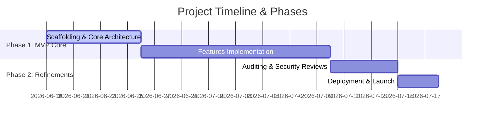

# Product Requirements Document (PRD) — [Project Name]

> [!NOTE]
> This is a placeholder Product Requirements Document (PRD) template. Replace the sections below to detail your own project scope, objectives, and functional specifications.

---

## 1. Executive Summary
- **Problem Statement**: [What problem is this project/feature trying to solve?]
- **Proposed Solution**: [Briefly describe the proposed system or capability]
- **Target Audience**: [Who are the primary users of this product?]
- **Value Proposition**: [Why does this solution matter to the user?]

---

## 2. Objectives & Key Results (OKRs)
- **Objective**: [The primary high-level goal of the project]
  - **KR1**: [Quantifiable metric, e.g. reduce checkout time by 30%]
  - **KR2**: [Quantifiable metric, e.g. achieve 99.9% API uptime]

---

## 3. Scope & Feature Boundaries

### In-Scope (Phase 1 MVP Core)
- [ ] **Feature A**: [Describe functional requirement]
- [ ] **Feature B**: [Describe functional requirement]

### Out of Scope (Future Phases)
- [ ] **Feature C**: [Describe deferred requirement]
- [ ] **Feature D**: [Describe deferred requirement]

---

## 4. User Stories & Functional Specifications

| Story ID | As a... | I want to... | So that... | Acceptance Criteria |
|---|---|---|---|---|
| US-01 | User | [action] | [benefit] | [criteria 1], [criteria 2] |
| US-02 | Admin | [action] | [benefit] | [criteria 1], [criteria 2] |

---

## 5. Non-Functional Specifications
- **Performance**: [e.g. Page loads under 500ms, visible progressive feedback]
- **Security**: [e.g. Row-Level Security, parameterized queries, CSRF guards]
- **Scalability**: [e.g. Decoupled module boundaries, horizontal database read-replicas]
- **Usability**: [e.g. WCAG 2.1 accessibility, keyboard outline navigations]

---

## 6. Implementation Phases & Milestones

---

## 7. Technical Risks & Mitigation Strategies

| Risk Description | Severity | Probability | Mitigation Strategy |
|---|---|---|---|
| **API Latency**: DB connection overhead slows page load times | High | Medium | Implement Redis caching layer and optimize indexes |
| **Token Exhaustion**: Subagents entering recursive loops | Medium | High | Enforce Auditor gate attempt caps and loop operator limits |
